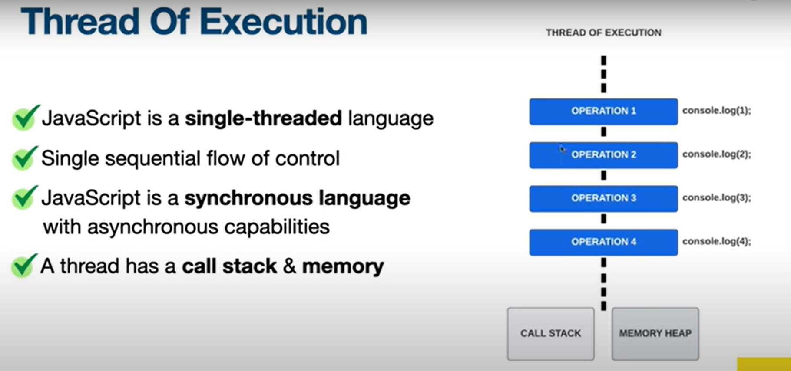
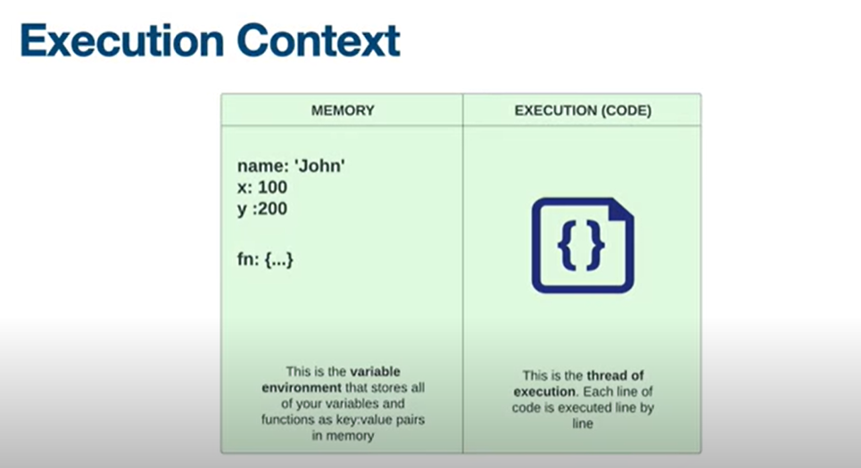
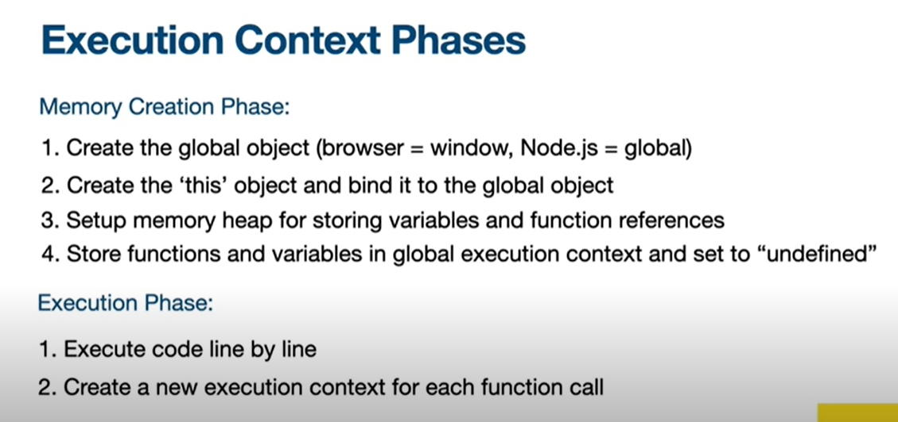
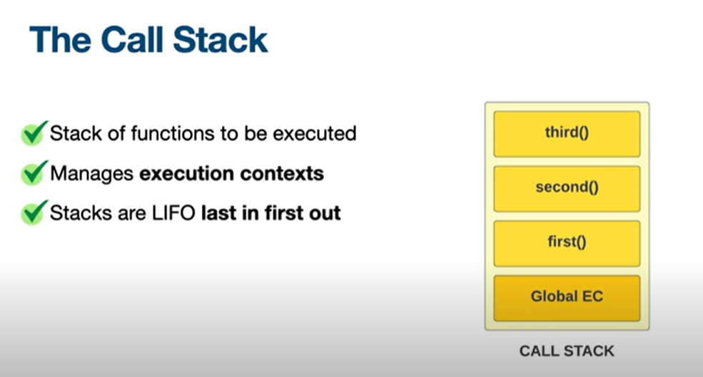
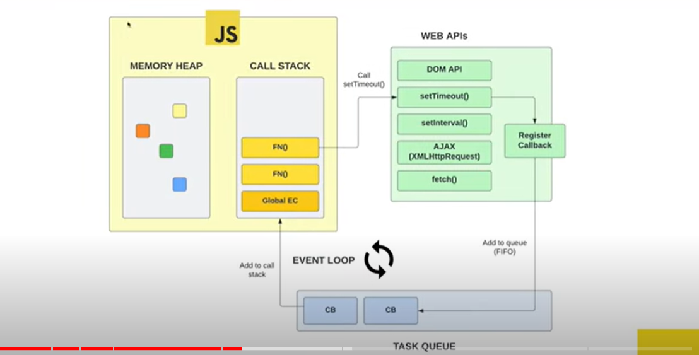
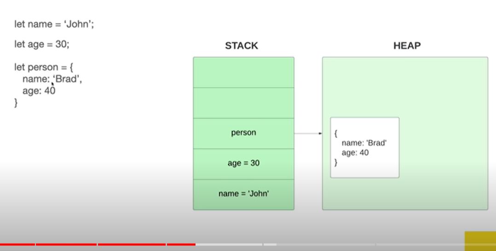
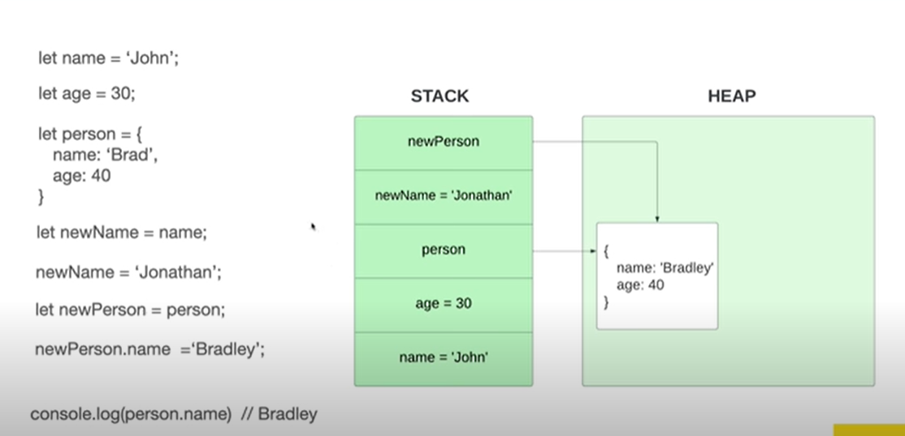

# Working Of Javascript

What is javascript?
JavaScript is a dynamic typed single-threaded language. It was developed by Brendan Eich in september 1995.Initially, it was called Mocha, then LiveScript, and was later renamed JavaScript.

#### How javscript code works in browser?

JAVASCRIPT CODE ----> PARSER ----> JS ENGINE

- Javscript code - The code that is written in the Script.js
- Parser - Parser go through line by line and check if the syntax of the code is correct
- JS Engine - Js Engine is computer program that executes javascript code and converts it into computer understandable language (Machine Code)

Firstly the Jscode is parsed and check if the syntax of the code is correct.Now the browser doesn't understand the high level of JS code, so it is send to JS Engine.When the JS Engine scans a script file it makes an environment called Execution Context that handles the entire tranformation and execution of the code.



#### What is Execution Context?

When the JS Engine scans a script file it makes an environment called Execution Context that handles the entire tranformation and execution of the code.

There are two types of Execution Context:

- Global Execution Context
- Function Execution Context

Global Execution Context:
The global execution context is created when a JavaScript script first starts to run, and it represents the global scope in JavaScript.

Function Execution Context:
A function execution context is created whenever a function is called, representing the function's local scope.

When a javascript file is created there will be only one Global Execution Context but there could be many Function Execution Context.

#### How Execution Context is created?

There will be two phases when a Execution Context is created, One is Creation Phase and the other one is Execution Phase

Creation Phase:
During this phase, JavaScript allocates memory for variables and assigns them an initial value of undefined. It also stores functions in memory (hoisting) and sets up the scope chain and this value.

Execution Phase:
In this phase, JavaScript executes the code line by line, performing assignments, computations, and function calls. Functions are executed within their own execution contexts.




Execution Context has many Function Execution Context and it is managed by Execution Stack.

#### What is Call stack?

A Call Stack is a stack with LIFO(Last In First Out) structure, which is used to store all the Execution Context created during the code Execution.

Function Calls: When a function is called in JavaScript, a new execution context for that function is created, which includes information about the function's arguments, local variables, and its scope.

Push onto Stack: This newly created execution context is pushed onto the top of the call stack.

Execution: The function's code is executed within its context. If this function calls other functions, their contexts are also pushed onto the stack, creating a chain of contexts.

Pop from Stack: When a function finishes executing, its context is popped (removed) from the top of the call stack.

Other Names For Call Stack:

- Execution context Stack
- Program Stack
- Control Stack
- Runtime stack
- machine Stack

EXAMPLE:

1. Whenever you call a function for its execution, you are pushing it to the stack.
2. Whenever the execution is completed, the function is popped out of the stack.

```js
function start() {
  next();
}
function next() {
  return "I am next";
}

// Invoke the `start` function
start();
```

1. Add the start() function to the call stack list and execute the code.
2. Add the next() function to the call stack list and execute the code.
3. Delete the next() function from our call stack list.
4. Delete the start() function from the call stack list since there are no items anymore.




#### Event Loop

The event loop is a process that continuously monitors both the call stack and the event queue and checks whether or not the call stack is empty. If the call stack is empty and there are pending events in the event queue, the event loop dequeues the event from the event queue and pushes it to the call stack. The call stack executes the event, and any additional events generated during the execution are added to the end of the event queue.



1.  All the callback function which comes through promises will go inside Microtask Queue(more priority)
2.  Other callback function will go inside callback queue

#### what is Event Queue?

The event queue follows the queue data structure. It stores async callbacks to be added to the call stack. It is also known as the Callback Queue or Macrotask Queue.

Whenever the call stack receives an async function, it is moved into the Web API. Based on the function, Web API executes it and awaits the result. Once it is finished, it moves the callback into the event queue (the callback of the promise is moved into the microtask queue).

The event queue constantly checks whether or not the call stack is empty. Once the call stack is empty and there is a callback in the event queue, the event queue moves the callback into the call stack. If there is a callback in the microtask queue as well, it is moved first. The microtask queue has a higher priority than the event queue.

#### Memory Storage(garbage collection)

Higher level languages like JS automatically allocates memory when objects are created and free it when they are not used anymore. This is called Garbage Collection.

DATA TYPES:

1. Primitive Types: Stored directly in the "Stack", where it is accessed from.
2. Reference Types: Stored in the heap and accessed by reference.

Primitive types are stored in the stack because they are fixed but reference are not a fixed value in array, object or function so it needs more memory.



